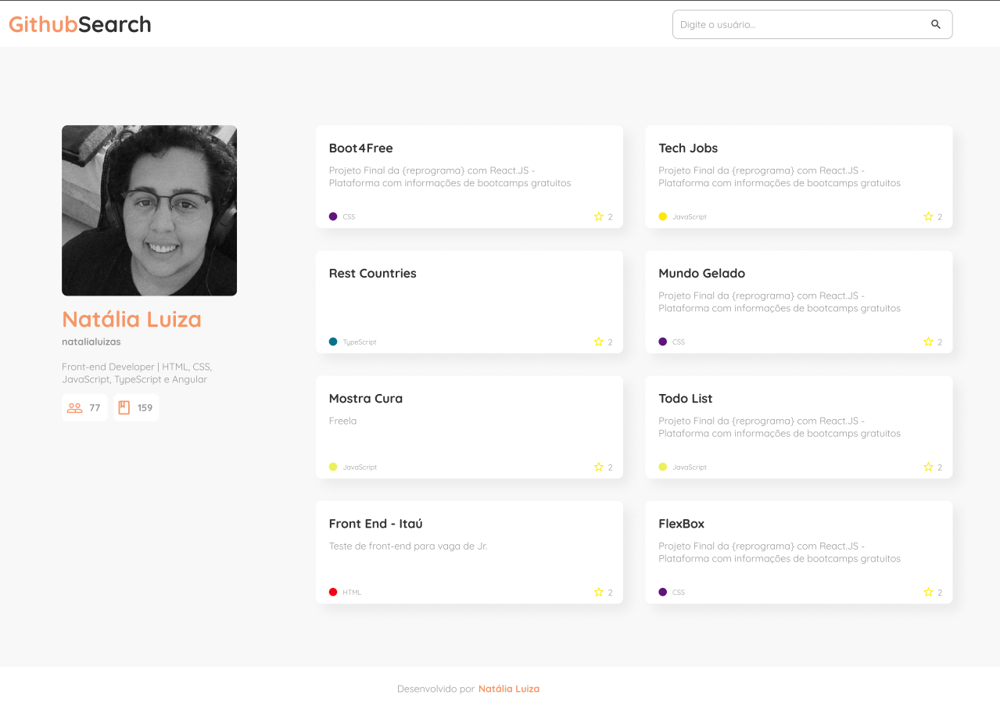
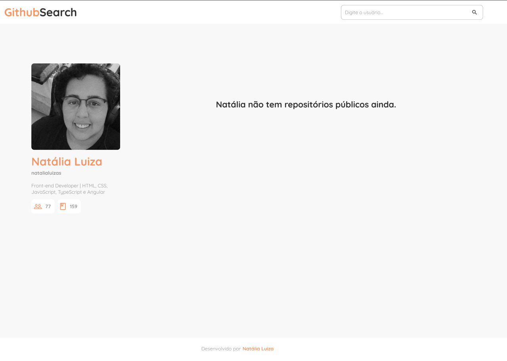

# Desafio do módulo final de JavaScript da <a href="https://reprograma.com.br/">{reprograma}</a>.

## Desafio de API - Github Search

- Veja como ficou a fase 1 👉 <a href="https://githubsearchfase1.netlify.app/">Link da fase 1</a>
- Veja como ficou a fase 2 👉 <a href="https://githubsearchfase2.netlify.app/">Link da fase 2</a> -> (:construction: *Não finalizada*)

Neste projeto, foi criada uma aplicação de pesquisa que usa a API GitHub para recuperar informações do usuário quando um nome de usuário válido é inserido. Ele deve exibir avatar, nome de usuário, contagem de seguidores, contagem de repositórios.

# Links

- [Layout do projeto](https://www.figma.com/file/UjuUSqwVpb7OtbWysQZffj/github-search?node-id=0%3A1)
- [Documentação - API GitHub](https://docs.github.com/pt/rest)

## Fase 1
- [ ] Criar o layout seguindo o Figma disponibilizado.
- [ ] O Input recebe o username de um usuário. Quando clicar no botão de pesquisa, caso o usuário exista dentro da base de dados da API, a aplicação deve mostrar os dados desta forma: 
   - Exibir o avatar.
   - Nome do usuário.
   - Username
   - Bio
   - Total de seguidores
   - Total de repositórios

**Exemplo**: 

  

- [ ] Validar campo de texto para não entrar texto vazio
- [ ] Limpar campo de texto depois que inserir o nome de usuário
- [ ] O usuário deve receber um alerta se o nome de usuário não for válido 
  

**Exemplo**: 

  

## Fase 2 - Extra

- [ ] Exibir todos repositórios do usuário, com as informações:
    - Titulo
    - Descrição
    - Linguagem utilizada
    - Total de estrelas
- [ ] A página deve exibir um alerta caso o usuário pesquisado não tenha repositórios públicos  

**Exemplo**: 

  

  

## Como vou entregar o projeto?
- Por Pull Request. 

